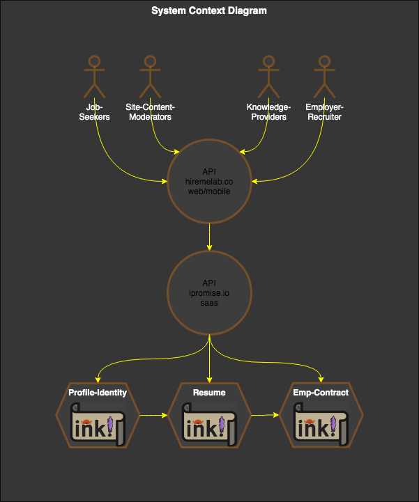

# Open Grant Proposal

* **Project:** ipromiseio
* **Proposer:** Mike Stankavich
* **Payment Address:** 3JnRfeKYYuSTEGKZDbcTKUWMy9NXbuaJKF 

## Project Overview :page_facing_up: 

### Overview

  * A brief description of the project.

    Irrefutable provenance and historical traceability from HR Skillset, food, medicine, dry-goods, etc. is essential in ensuring quality, authenticity, and greater accountability to its management in the supply/value-chain.

    Our work, ipromise.io (pronounced, I promise you) SaaS will be centered on providing a decentralized supply-chain ledger service purposely for irrefutable smart-contract using rust, substrate, FRAME and Ink! The ipromise.io will be consumed by [HireMeLab](www.hiremelab.com) to present a pool of human resources with irrefutable skillsets in rust, substrate, devops and cloud initially just to narrow the scope.
        
  * An indication of how you will integrate this project into Substrate / Polkadot / Kusama.

    Substrate and Ink! will be leveraged as the smart contract ledger that defines the desired properties and conditions. Where these could be deployed to Kusama and Polkadot at its earliest projected verison.

  * An indication of why your team is interested in creating this project.

    The team has been into Horizen Proof of Service [Masternode Managed Service Hosting](www.nodelauncher.com) for the past couple of years and is looking at a way to upgrade/update its knowledge and learn to use newer and more current advancements in Blockchain technology especially on dApps and most specifically DeFi. 

    Our intent eventually, is how we could use web3.0 and PolkaDot as a platform to offer or enable more of our software engineering and DevOps capabilities as a service in a resource pool that could be leveraged by other projects while at the same time build our profile to develop DeFi apps. 

    As our next step (in the short haul), we are also looking at the possibility of developing a multi-cloud IAC deployable Parachain using the Kubernetes platform. And in many ways, enable us to develop more use cases as described below.

  * Other use-cases we are looking at are for DeFi payments, loan, supply-value-chain,
    crowd-funding or mutually pooled funding for Proof-of-Service (masternodes) and Proof-of-Stake (Staking) on managed-service hosted nodes for validators, collators, nominators, fishermen. And of course, for our first use case, we'll focus on building a verfied talent pool for Blockchain-skilled resource.    

### Project Details 
We expect the teams to already have a solid idea about the project's expected final state.

Therefore, we ask the teams to submit (where relevant):
* Mockups/designs of any UI components
  <TODO>

* API specifications of the core functionality
  <TODO>

* An overview of the technology stack to be used
  <TODO>

* Documentation of core components, protocols, architecture etc. to be deployed
  <TODO>

  * System Context Diagram is a high-level view of the interaction between user personas and the the application. 

    It implies that the app lifecycle begins when a job-seeker, plausible still in high-school, a fresh college-graduate or even experienced IT developers who have gained some level of certified or experiential developer skills on specific languages or administrative operational skills on key platforms commits to 
    stake into the system with its authentic identity, made anonymous by the system, but has achieved validation from knowledge-providers and certification bodies. Their private resumes are built and updated as a form of smart-contract and could be matched to a requirement of a recruiter. The lifecycle reaches almost 360 degrees when the employer offers an employment contract. 
  
  
    
  * Architecture Overview is an artifact that provides an overview of the ‘main conceptual elements and relationships’ of the application architecture. It represents the governing ideas and ‘candidate high-level building blocks’ of the architecture.
  
      
  
* PoC/MVP or other relevant prior work or research on the topic

  There exist an MVP using our [HR App](https://hiremelab.com) that will interface with our substrate-based Blockchain Smart-Contract SaaS ipromise.io that provides a central endpoint to create an Identity, Deploy, Update and View the State.

### Ecosystem Fit 
Are there any other projects similar to yours? If so, how is your project different?

www.litentry.com - this seems intended as a very general purpose Identity-centric for a broad range of usecases running in a custom parachain with their own economic token.

We don't think they're a competiotion, but once they mature, our solutions could be complementary.

We intend a very specific use case for a skills pool that will serve as our entry to also develop our parachain in a CN platform. We can expand this later for other use-cases in the Supply/Value-Chain for Logistics and Trading, maybe with our own token as well.

## Team :busts_in_silhouette:

### Team members
* Name of team leader: Mike Stankavich
* Names of team members: Edison Macabebe
                         Zoilo dela Cruz 

### Team Website	
* https://ipromise.io
* https://hiremelab.com

### Legal Structure 
Please provide the name and registered address of the legal entity executing the project.

Jackson Peak LLC. Website in progress for [OPSUMO](https://opsumo.co).

### Team's experience

The team has been into providing a Horizen Proof of Service [Masternode Managed Service Hosting](www.nodelauncher.com) for the past couple of years. Here are examples of our commit snips: [1](https://github.com/MikeStankavich/zencash-securenode), and [2]().

### Team Code Repos
* https://github.com/mikestankavich
* https://github.com/edmacabebe
* https://github.com/luxknight007 

### Team LinkedIn Profiles
* https://www.linkedin.com/in/mikestankavich/
* https://www.linkedin.com/in/edison-macabebe-31709b35/
* https://www.linkedin.com/in/zoilodelacruz/

## Development Roadmap :nut_and_bolt: 

This section should break out the development roadmap into a number of milestones. Since the milestones will appear in the grant contract, it helps to describe the functionality we should expect, plus how we can check that such functionality exists in the product. Whenever milestones are delivered, we refer to the contract to ensure that everything has been delivered as expected.

Below we provide an **example roadmap**. In the descriptions it should be clear how the project is related to Substrate and/or Polkadot. We recommend that the scope of the work can fit within a 3 month period and that teams structure their roadmap as 1 month = 1 milestone. 

For each milestone:
* Please be sure to include a specification of the software. The level of detail must be enough so that we are able to verify that the software meets the specification.
* Please include total amount of funding requested per milestone.
* Please note that we require documentation (e.g. tutorials, API specifications, architecture details) in each milestone. This ensures that the code can be widely used by the community.
* Please provide a test suite, comprising unit and integration tests, along with a guide on how to run these.
* Please commit to providing a dockerfiles for the delivery of your project. 
* Please indicate the milestone duration, as well as number of Full-Time Employees working on each milestone, and include the number of days along with their cost per day.

### Overview
* **Total Estimated Duration:** Duration of the whole project
* **Full-time equivalent (FTE):**  Workload of an employed person ([see](https://en.wikipedia.org/wiki/Full-time_equivalent)) 
* **Total Costs:** Amount of Payment in BTC for the whole project. The total amount of funding needs to be below $30k at the time of submission.

### Milestone 1 — Implement Substrate using Ink!3.0 for a Profile ID, a Resume and a Smart Contract and End-to-End call between Hiremelab.co -> ipromise.io to create the profile

* **Estimated Duration:** 1 month
* **FTE:**  2
* **Costs:** 0.8 BTC

| Number | Deliverable | Specification |
| ------------- | ------------- | ------------- |
| 0a. | License | Apache 2.0 / MIT / Unlicense |
| 0b. | Documentation | We will provide both inline documentation of the code and a basic tutorial that explains how a user can call the ipromise.io API. |
| 0c. | Testing Guide | The code will have proper unit-test coverage (e.g. 90%) to ensure functionality and robustness. In the guide we will describe how to run these tests | 
| 1. | Ink 3.0 Contract: PID | Profile Identity to allow a User, in particular, a Job-Seeeker or Recruiter to create and identity |  
| 2. | Ink 3.0 Contract: Resume | Resume is a form of Smart Contract declaring the Skill-sets with levels of truthiness and can be validated by a Knowledge or Certification body |  
| 3. | Ink 3.0 Contract: Employment Contract | Employment Contract with rates and rules |  
| 4. | ipromise.io feature 1 | Allows a caller to create an ID and profile |
| 5. | ipromise.io feature 2 | Allows a caller to create a basic resume |  

### Milestone 2 Example — Additional features

* **Estimated Duration:** 1 month
* **FTE:**  2
* **Costs:** 0.8 BTC

| Number | Deliverable | Specification |
| ------------- | ------------- | ------------- |
| 1. | ipromise.io feature 3 | Allows a caller to update resume | 
| 2. | ipromise.io feature 4 | Allows a validated certifying or knowledge provider entity update resume with a validation |
| 3. | ipromise.io feature 5 | Allows recruiter to create a search criteria based on a job specs/requirement |  
| 4. | ipromise.io feature 6 | Allows ipromise.io to match a recruiter criteria to a Resume |
| 5. | ipromise.io feature 7 | Allows hiremelab.io to hire a job-seeker from a candidate short list and set a contract|

### Milestone 3 Example — NFRs

* **Estimated Duration:** 1 month
* **FTE:**  2
* **Costs:** 0.8 BTC

| Number | Deliverable | Specification |
| ------------- | ------------- | ------------- |
| 1. | Dockers | We will provide a dockerfile to demonstrate the full functionality of our chain |
| 2. | Kubernetes | We will initially use a local env to enable Kubernetes |
| 3. | CICD | Setup ArgoCD with possibly Tekton | 
| 4. | Ansible | Automated Configuration Management |
| 5. | Terraform | IaC to deploy to a Kubernetes platform in say, AWS or GCP |  

### Community engagement

As part of the Program, we require that you produce an article/tutorial and publish it (for example on [Medium](https://medium.com/)). It should explain your work done as part of the grant. 

Normally, we ask you to submit the write-up upon the completion of your grant, although for larger projects it might make sense to publish multiple articles after the completion of different milestones.

## Future Plans
Please include the team's long-term plans and intentions.

## Additional Information :heavy_plus_sign: 
Any additional information that you think is relevant to this application that hasn't already been included.

Possible additional information to include:
* What work has been done so far?
* Are there are any teams who have already contributed (financially) to the project?
* Have you applied for other grants so far? Plan is to apply here first, then try pitch this to locally-based
  startup fund.
